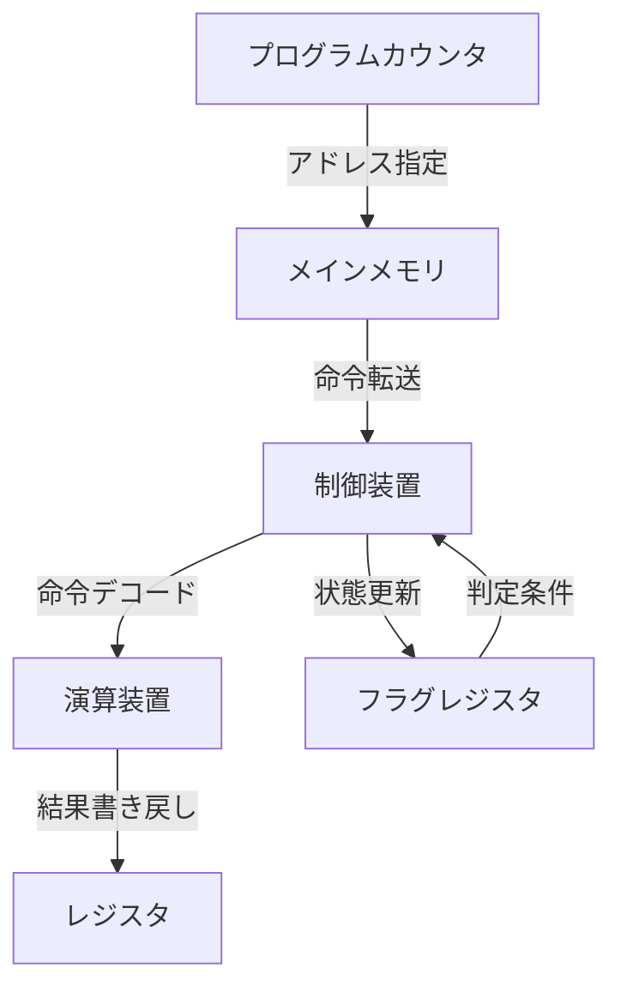

# [Study]: プログラムはなぜ動くのか 第一章 - Summary
Source: #4

---

---
title: "プログラマにとってのCPUアーキテクチャの基礎"
tags: [CPU, Architecture, Assembly, MemoryManagement]
category: System Programming
updated_at: 2024-05-22
---

## TL;DR (Executive Summary)
- CPUは「転送・演算・分岐・呼び出し」の4つの基本動作をクロック信号に同期して繰り返す、極めて単純かつ情熱的な実行ユニットである。
- プログラムとは、メモリ上の命令とデータをプログラムカウンタ（PC）が順次指し示すことで実現される「ハードウェアへの命令シーケンス」に過ぎない。
- 高水準言語の複雑なロジックも、最終的にはフラグレジスタを用いた減算ベースの比較や、スタック領域を利用したCALL/RET構造へと還元される。

---

## Core Concepts & Modern Context (核心の理解と現代的解釈)

CPUの本質は「レジスタ（高速な作業領域）」と「メモリ（巨大なデータ倉庫）」の距離を、クロックという名の指揮棒のもとで制御する機構である。

### 【Deep Dive】
現代のCPUは、単に命令を1つずつこなすだけでなく、以下の最適化技術によって「見かけ上の性能」を極限まで引き上げている。

1. **パイプライン処理**: 命令の「取得」「解読」「実行」「書き戻し」を多段化し、工場のように並列実行する。
2. **投機的実行**: 分岐予測に基づき、条件分岐の結果が確定する前に「おそらくこちらに進むだろう」という命令を先読み実行する（失敗するとフラッシュされる）。
3. **レジスタ・リネーミング**: コンパイラが吐き出した命令以上の効率を出すため、物理レジスタを論理レジスタに動的に割り当て、依存関係のない命令を同時実行する。

#### 概念図：CPUの実行ループ

---

## Architectural Insights (設計・実務への応用)

本知識は、パフォーマンスチューニングにおける「迷路」からの脱出路を提供する。

- **メモリ配置とキャッシュ効率**: 
  ポインタを多用するリスト構造（パターンB）が遅いのは、CPUが「次にアクセスすべきメモリアドレス」を計算するまでデータ転送を待たなければならないからである（メモリアクセスのレイテンシ）。配列（パターンA）のようにメモリが連続していれば、CPUは先読みを行い、パイプラインを停止させない。
- **再帰とスタック**: 
  関数呼び出し（CALL）には、戻り先アドレスをメモリ上のスタック領域に退避するコストが伴う。再帰呼び出しが深すぎると、スタック領域の制限（Stack Overflow）に直面する。これは「CPUの命令構造上の物理的制約」であることを理解し、巨大なデータに対しては再帰ではなくループ（ジャンプ命令の活用）を選択する判断力が求められる。
- **64bit演算の仕組み**:
  CPUがレジスタのサイズを超えて演算する場合、フラグレジスタ（キャリーフラグ）を介して、ADC（Carry付き加算）命令を使う。複数のレジスタを「連動」させる概念は、マルチスレッドや並列コンピューティングの基礎概念となる。

---

## Related Topics for Exploration (次なる探求先)

本メモの内容をさらに深化させるために、以下のキーワードを調査せよ。

- **データ・アライメント**: なぜデータは4バイトや8バイト境界に配置されると速いのか（メモリアクセスの粒度）。
- **パイプラインハザード**: 投機的実行がいかにしてCPUの計算効率を最大化し、かつリスク（Spectre脆弱性等）を孕むのか。
- **スタックフレームの構造**: 関数呼び出し時のベースポインタ（EBP/RBP）とスタックポインタ（ESP/RSP）が、どのようにデバッガでスタックトレースを構築しているのか。
- **アーキテクチャの比較**: x86（CISC: 複雑な命令セット）とARM（RISC: シンプルな命令セット）の設計思想の違い。
