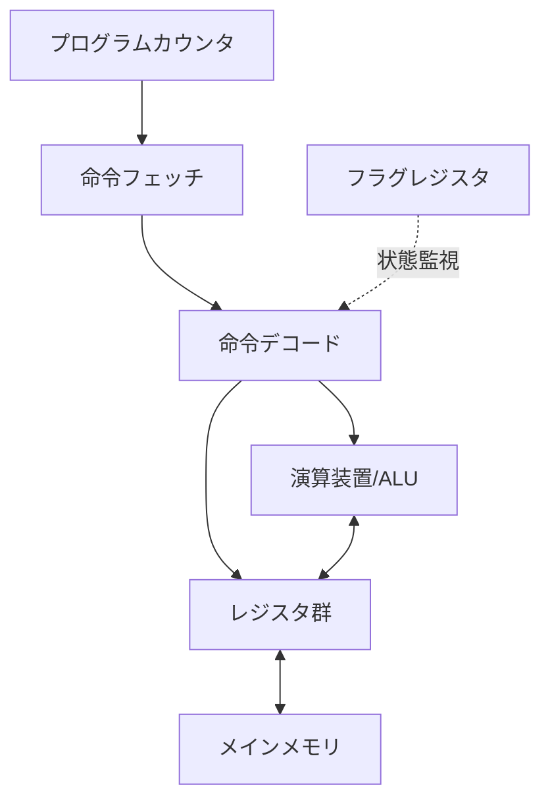

# [Study]: プログラムはなぜ動くのか 第一章 - Summary
Source: #4

---

---
title: "Computer Architecture Essentials: Understanding CPU Execution Flow"
tags: [CPU, Architecture, Low-level, MemoryManagement, Assembly]
category: "Computer Science Fundamentals"
updated_at: 2024-05-22
---

## TL;DR (Executive Summary)
- CPUは複雑な論理を実行する万能機械ではなく、データ転送・演算・分岐・呼出という4つの基本命令を高速に繰り返す「シンプルかつ高頻度な実行装置」である。
- プログラムの実行本質は「プログラムカウンタが指すメモリ番地を順次解釈し、フラグレジスタの状態に基づいてフローを制御する」ことにある。
- 実務上のパフォーマンス課題は、CPUの命令パイプラインやメモリ階層（キャッシュ）との「仲の良さ」を意識したコード設計によって解決できる。

---

## Core Concepts & Modern Context (核心の理解と現代的解釈)

### CPUの抽象モデル
CPUはトランジスタの集合体であるが、プログラマ視点では「レジスタ」と「制御装置」のインターフェースとして捉えるべきである。

### 【Deep Dive】現代的アーキテクチャの視点
1. **パイプラインと投機的実行**:
   現代のCPUは、単純に命令を一つずつ実行するのではなく、数段〜数十段のパイプラインで並列処理している。`ジャンプ命令`（条件分岐）はパイプラインの大きな阻害要因（ストール）となるため、CPUは分岐予測を行い、誤った場合に破棄する「投機的実行」を行う。これがMeltdownやSpectreといったサイドチャネル攻撃の温床となる。
2. **x86 (CISC) vs ARM (RISC)**:
   メモにある「4つの基本命令」はRISC（Reduced Instruction Set Computer）的な発想に近い。x86系は可変長命令を持つ複雑なCISCだが、内部的にはMicro-op（μOp）と呼ばれる単純なRISCに近い命令に変換して実行している。
3. **レジスタの役割**:
   現代のx86-64アーキテクチャでは、汎用レジスタ（RAX, RBX, RCX等）の使い分けがコンパイラの最適化に直結する。メモリへのアクセスは極めて高コスト（数百サイクル）であるため、コンパイラがいかにデータをレジスタ内に留めるか（レジスタ割付）が実行速度を決定する。

---

## Architectural Insights (設計・実務への応用)

### 高水準言語との接続
- **デバッグ・トラブルシューティング**: プログラムがクラッシュ（Segmentation Fault）した際、それが「どのメモリアドレスで、どの命令を実行しようとした時か」を理解することは、スタックトレースを読む以上の洞察を与える。
- **パフォーマンスチューニング**:
  - **キャッシュヒット率**: CPUのレジスタ操作は一瞬だが、メモリは遠い。配列アクセスにおいて「ベースレジスタ＋インデックス」の仕組みを理解していれば、キャッシュラインを意識したデータ構造（データ局所性）の重要性が自明となる。
  - **条件分岐の最適化**: `if-else`の連続はフラグレジスタへの依存を高め、パイプラインの分岐予測を困難にする。ホットなループ内では、条件分岐を減らすためのビット演算（Branchless Programming）が有効となる場合がある。
- **関数呼び出しのコスト**: コール・リターンは単なるアドレス遷移ではなく、スタックポインタの操作と退避というコストを伴う。極端に深い再帰や巨大なスタックフレームは、キャッシュミスやスタックオーバーフローを誘発する。

---

## Related Topics for Exploration (次なる探求先)

- **メモリ階層**: L1/L2/L3キャッシュの仕組みと、なぜ「順次アクセス」が高速なのか（空間的局所性）。
- **コンパイラの挙動**: `gcc -S` や `clang -S` を使用した、高水準言語がどのようにアセンブリに変換されるかの観察。
- **Calling Convention (呼出規約)**: 引数をレジスタで渡すか、スタックで渡すか。x86-64 System V ABIなどの標準規格。
- **OSのメモリ管理**: 仮想メモリとページテーブル、MMU（Memory Management Unit）の役割。
- **RFC 2219**: ハードウェアのパフォーマンス監視技術（Hardware Performance Counters）に関する理解。
