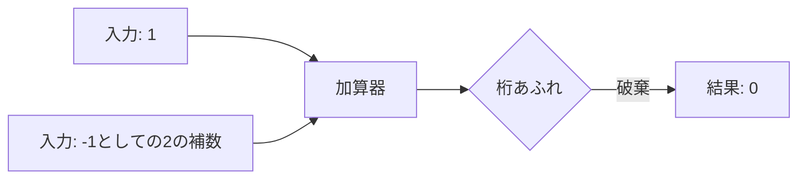

# [Study]: プログラムはなぜ動くのか 第2章 - Summary
Source: #5

---

---
title: コンピュータアーキテクチャの基礎：2進表現と算術演算の物理的基盤
tags: [ComputerArchitecture, BitManipulation, LowLevel, CPU]
category: Fundamentals
updated_at: 2024-05-22
---

## TL;DR (Executive Summary)
- コンピュータの論理は、電気的ON/OFFの二値状態をベースとしたアナログな物理現象の抽象化である。
- 負数表現や減算は「2の補数」を用いた加算器のオーバーフロー活用により、ハードウェアコストを最小化して実装されている。
- ビットシフトや論理演算はCPUの基本サイクルで実行される最速の命令群であり、これらを活用することが低レイヤのパフォーマンス最適化の鍵となる。

## Core Concepts & Modern Context (核心の理解と現代的解釈)

### 2進数と物理層の制約
現代のシリコンチップ（CMOS回路）は、電圧レベルを「閾値以下(0)」と「閾値以上(1)」の二状態で判定する。この物理的な制約が、コンピュータがすべてを2進数で処理する根本的な理由である。

### 【Deep Dive】2の補数と演算回路の抽象化
多くの初心者は「負の数」を数学的な概念として捉えるが、実態は**「加算器のみで減算を完結させるためのハードウェア最適化」**である。

*   **現代的視点**: 
    *   **投機的実行の影響**: 現代のCPUは分岐予測を行うが、算術演算のフラグ（Zero Flag, Carry Flagなど）はパイプラインの深層で厳密に管理される。
    *   **x86/ARMの比較**: どちらも2の補数を用いるが、ARMの命令セット（A64等）は柔軟なバレルシフタを備えており、1サイクルで「演算 + シフト」を実行可能。これにより、コンパイラは配列アクセスやアドレス計算を極めて効率的に最適化できる。

## Architectural Insights (設計・実務への応用)

### パフォーマンスチューニングへの寄与
*   **算術演算の置換**: 高水準言語で書かれた `x * 2` や `x / 4` は、コンパイラによって最適化されることが多いが、クリティカルパス上の処理ではシフト演算を意識することで、パイプラインのレイテンシを最小化できる。
*   **メモリフットプリントの削減**: 8bit/16bit単位のビットフィールド操作を理解していれば、構造体のパディングを最小化し、キャッシュヒット率を向上させる設計が可能となる。
*   **デバッグ能力の向上**: 符号拡張のルール（算術右シフト）を知っていれば、型変換（キャスト）時に発生する「意図しない負の値への変換」や「正の数への誤認」という典型的なバグを即座に特定できる。

### 使いどころ・注意点
*   **XOR演算の活用**: XORは自己逆変換（`A ^ B ^ B = A`）が可能。暗号化の基礎や、一時変数を使わないスワップアルゴリズム、フラグのトグル等、計算量を増やさずに処理を行う現場の定石である。
*   **符号の扱い**: 算術右シフトと論理右シフトの混同は、特にバイナリプロトコルのパース時に壊滅的なバグを招く。言語仕様書で「右シフトが算術的か論理的か」を常に確認すること。

## Related Topics for Exploration (次なる探求先)

- **IEEE 754 浮動小数点数**: 整数（固定小数点）の限界を超え、浮動小数点がなぜ指数部と仮数部で表現されるのか（精度と誤差のメカニズム）。
- **ALU (Arithmetic Logic Unit) 設計**: 実際に加算器が半加算器・全加算器の組み合わせでどう構成されているか。
- **Endianness (バイトオーダー)**: メモリ上に並ぶ際のバイトの順序（Big Endian vs Little Endian）と、ネットワークプロトコルでの扱い。
- **SIMD (Single Instruction, Multiple Data)**: 1つの命令で複数のデータを一度に演算する現代の並列処理アーキテクチャ（SSE, AVX, NEON等）。
