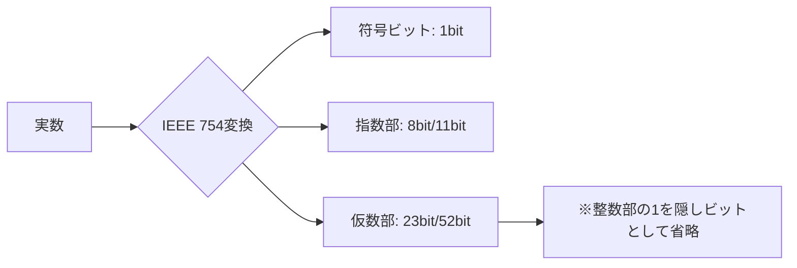

# [Study]: プログラムはなぜ動くのか　第3章 - Summary
Source: #6

---

---
title: 浮動小数点数演算の仕組みと精度の限界
tags: [computer-architecture, floating-point, binary, precision, systems-programming]
category: Computer Science Fundamentals
updated_at: 2024-05-22
---

## TL;DR (Executive Summary)
* 2進数表現の制約により、多くの10進小数（例: 0.1）は循環小数となり、コンピュータ内部では近似値として保持される。
* 浮動小数点数（IEEE 754等）は「符号・仮数・指数」で構成され、ビット幅に応じて有効桁数と精度が制限される。
* 金融計算など正確性が必須の領域では、浮動小数点数型を避け、固定小数点数（整数変換）や専用のBigDecimalライブラリを用いるのが定石である。

## Core Concepts & Modern Context (核心の理解と現代的解釈)

### 浮動小数点数のメカニズム
コンピュータ内部では数値を $±m \times 2^e$ （符号・仮数・指数）の形で保持する。特にIEEE 754規格では、正規化を行い整数部（必ず「1」になる）を省略することで、限られたビット数内で表現可能な範囲を最大化している。

### 【Deep Dive】現代的視点での補足
1.  **表現の不連続性**: 浮動小数点数は「広い範囲を表現できる」一方で、数値が大きくなるほど「隣り合う数値間の隙間」が大きくなる。これが累積誤差の温床となる。
2.  **ハードウェア演算ユニット**: モダンなCPUはFPU（Floating Point Unit）を備え、SIMD命令（AVX-512等）を用いて高速に計算するが、演算順序の入れ替え（結合法則の不成立）により、並列処理時に微妙な誤差が生じることがある。
3.  **イクセス表現の役割**: 指数部に負の値を扱う際、単純な2の補数表現ではなく、バイアス値を加えた「イクセス表現」を用いることで、浮動小数点数同士の大小比較を整数比較回路でそのまま行えるよう設計されている。

## Architectural Insights (設計・実務への応用)

### パフォーマンスと信頼性のトレードオフ
*   **トラブルシューティング**: デバッグ時に「`0.1 + 0.2 != 0.3`」に遭遇するのはバグではなく仕様である。比較演算を行う際は、必ず一定のイプシロン（許容誤差）を設けた判定が必要となる。
    *   `if (abs(a - b) < EPSILON)`
*   **設計指針**:
    *   **金融・会計システム**: 浮動小数点型は厳禁。通貨計算には、100円を10000銭として扱うような「整数型（Fixed-point）」を用いるか、`Decimal`等の多倍長精度演算ライブラリを利用する。
    *   **ゲーム・グラフィックス**: リアルタイム描画では多少の誤差は許容されるため、高速な`float`（単精度）が多用される。GPUの浮動小数点演算は、精度よりもスループットが優先される設計である。

### プロフェッショナルな注意点
*   **データ型選択**: 64bitの`double`なら安心と盲信してはならない。計算の回数が増えれば増えるほど、近似誤差は指数関数的に増大する。
*   **シリアライズの罠**: JSON等のテキストフォーマットで浮動小数点数をやり取りする場合、文字列化・再パースの過程でさらに微細な精度変化が起きる可能性がある。可能な限りバイナリ形式（Protobuf等）または固定小数点数の文字列変換を検討せよ。

## Related Topics for Exploration (次なる探求先)
*   **IEEE 754**: 浮動小数点数規格の基礎。NaN（Not-a-Number）や無限大の扱いについて。
*   **Fixed-point arithmetic (固定小数点数演算)**: 整数を使って小数を表現する技術の詳細。
*   **Kahan Summation Algorithm**: 大量の数値を加算する際に誤差を最小限に抑えるアルゴリズム。
*   **C++ `std::numeric_limits`**: 型ごとの精度限界をプログラム的に取得する手法。
