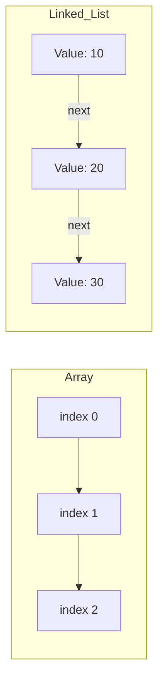

# [Study]: プログラムはなぜ動くのか 第4章 - Summary
Source: #7

---

---
title: "メモリ構造とデータ構造の基礎理論：物理層からアルゴリズムまで"
tags: ["Memory", "DataStructures", "ComputerArchitecture", "LowLevel"]
category: "Computer Science Fundamentals"
updated_at: 2023-10-27
---

## TL;DR (Executive Summary)
- メモリは物理的にはアドレス指定によるバイト単位の入出力装置であり、ソフトウェア上の「データ型」はそれを抽象化・解釈するための型定義である。
- ポインタはメモリ上の物理アドレスを直接操作する手段であり、スタックやキューはアドレス管理を隠蔽し、処理の順序性のみを保証するための制御構造である。
- リストや2分探索木は、データの追加・削除・探索コストを最小化するための論理的な配置設計であり、計算量理論におけるパフォーマンスチューニングの基礎となる。

---

## Core Concepts & Modern Context (核心の理解と現代的解釈)

### 1. メモリの二面性
メモリICの物理層は、アドレス信号とデータ信号を用いた極めて機械的なスイッチング処理である。しかし、プログラマが扱うメモリは「論理空間」であり、そこには**データ型（Data Type）**という概念がレイヤーとして存在する。

- **物理層:** バイト単位（8bit）のアクセスが基本。
- **論理層:** コンパイラがデータ型に基づき、メモリ上の連続領域をどう切り出すか（アライメント）を決定する。

### 2. メモリとポインタの構造
ポインタとは、単なる「アドレスという数値」を保持する特殊なデータ型である。
現代の64bit CPU環境では、ポインタ自体も64bit（8バイト）のメモリを占有する。

### 3. データ構造による計算効率化
計算量（Big O notation）の観点から、構造の違いは顕著である。

【Deep Dive】
- **CPUの投機的実行とキャッシュ:** 近代的なCPUは、配列のような「メモリ連続領域」に対して非常に高いプリフェッチ効率を誇る。一方で、リストや2分探索木のようなポインタを多用する構造は、メモリ上でデータが散らばる傾向があるため、「キャッシュミス（Cache Miss）」を引き起こしやすく、ポインタを追うたびにCPUがメインメモリの低速な応答を待機する「ストール」が発生しやすい。
- **アーキテクチャの制約:** x86/ARMともに、ポインタの参照先が境界を跨ぐ場合（Unaligned Access）、ペナルティが発生する。言語処理系やコンパイラが自動的に行うパディング（隙間詰め）は、この物理制約を緩和するためのものである。

---

## Architectural Insights (設計・実務への応用)

### パフォーマンスチューニングへの寄与
1. **配列 vs リスト:** 
   - 要素数が数千程度以下であれば、ポインタのオーバーヘッドを嫌ってあえて「配列」を使う方が、CPUキャッシュヒット率が高まり高速なケースが多い。
   - 要素の追加・削除が頻繁かつ大規模な場合に限り、リストや木構造の利点が生きる。
2. **スタックの活用:** 
   - 関数呼び出しのスタックフレームは、再帰呼び出しやローカル変数の管理に使用される。この「LIFO」の性質を知っていれば、スタックオーバーフローのエラーログから再帰の深さや引数の不正を即座に特定できる。
3. **リングバッファの実践:**
   - ネットワークのパケット処理やログストリームなど、メモリを固定的に確保し、オーバーライトを前提とした「リングバッファ」は、GC（ガベージコレクション）負荷を避けるための必須パターンである。

### プロフェッショナルな注意点
- **メモリリークの温床:** リストや木構造を動的確保する場合、メモリの解放（`free`/`delete`やガベージコレクタのスコープ管理）を怠れば、物理メモリは枯渇する。
- **抽象化の罠:** 高水準言語（Java, Python等）で書いていると、スタックやキューが「メモリ上にどう配置されているか」を忘れがちである。デバッグ時や高負荷時のプロファイリングにおいて、「隠蔽された物理レイヤー」を想像できるスキルが、シニアとジュニアを分ける境界線となる。

---

## Related Topics for Exploration (次なる探求先)

- **メモリ階層（Memory Hierarchy）**: L1/L2/L3キャッシュ、メインメモリ（DRAM）、仮想メモリの仕組み。
- **メモリ管理ユニット（MMU）**: 仮想アドレスと物理アドレスの変換（ページング）。
- **アライメントとパディング**: データ型がメモリ配置に与える影響。
- **メモリ安全性（Memory Safety）**: Rust等の言語がポインタ操作をどう安全に抽象化しているかの比較。
- **アルゴリズム計算量**: $O(n)$, $O(1)$, $O(\log n)$ が物理的な処理時間にどう変換されるかの理論。
