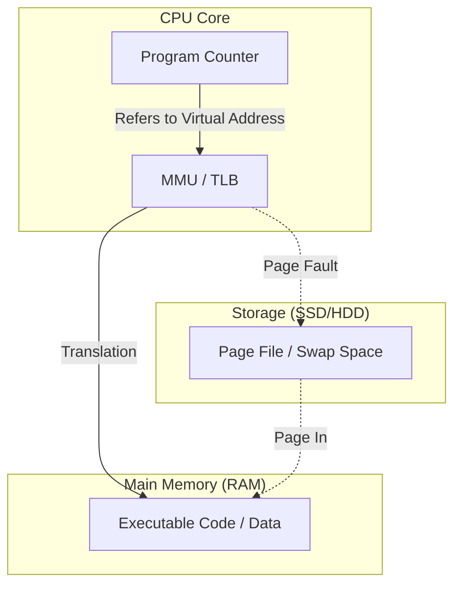

# [Study]: プログラムはなぜ動くのか 第5章 - Summary
Source: #8

---

---
title: コンピュータの記憶階層と仮想化：メモリ・ディスク管理のアーキテクチャ
tags: [architecture, memory-management, virtualization, low-level-programming, os-internals]
category: System Architecture
updated_at: 2024-05-22
---

## TL;DR (Executive Summary)
- 記憶階層（メモリ/ディスク）の特性差を理解し、OSが提供する仮想記憶（ページング）と物理制約を考慮した設計を行うことがパフォーマンスの根幹である。
- プログラムの実行単位である「ロード」と「実行」の物理的な場所を意識し、メモリI/Oを最小化する戦略が必要である。
- 共有ライブラリ(DLL)の活用や、関数呼び出し規約（Calling Convention）の最適化は、バイナリサイズ削減とメモリフットプリント抑制に直結する。

---

## Core Concepts & Modern Context (核心の理解と現代的解釈)

### 記憶階層とストアドプログラム方式
CPUが命令を実行するためには、対象コードがアドレッシング可能なメモリ空間に存在する必要がある。ストアドプログラム方式は、プログラムを外部記憶（Disk）から主記憶（Memory）へロードし、CPU内のプログラムカウンタ（PC）がメモリ上のアドレスを指すことで実行を成立させる。

### 【Deep Dive】現代的補足：メモリ管理ユニット (MMU)
現代のCPUは**MMU（Memory Management Unit）**を内蔵し、ハードウェアレベルで仮想アドレスから物理アドレスへの変換を行っている。

- **ページングとTLB**: 仮想記憶のページ単位（通常4KB）の管理には、ページテーブルが使用される。変換効率を上げるために、CPUは**TLB（Translation Lookaside Buffer）**というキャッシュを持ち、頻繁なアクセスを高速化している。
- **階層化の現代的意味**: SSDの普及によりディスクのI/Oコストは低下したが、依然としてL1/L2キャッシュ（nsオーダー）とメインメモリ（msオーダー）の間には絶大なレイテンシの壁が存在する。

---

## Architectural Insights (設計・実務への応用)

### パフォーマンスチューニングへの寄与
1. **ページング・スラッシングの回避**:
   アプリケーションが物理メモリ容量を超えてメモリを消費すると、頻繁なページイン・ページアウト（スラッシング）が発生する。これはCPU性能ではなく、ディスクI/O帯域がボトルネックとなる。高負荷環境では、各プロセスのメモリフットプリントを最小化することが、システム全体の応答性を維持する鍵となる。
2. **DLLによる動的リンクの恩恵**:
   静的リンク（スタティックリンク）はバイナリサイズを肥大化させ、メモリ空間を無駄に占有する。同一コードを複数のプロセスが共有できるDLL（共有ライブラリ）の採用は、現代のOSにおけるメモリ効率化のベストプラクティスである。
3. **呼び出し規約（Calling Convention）の最適化**:
   `__stdcall` は呼び出された関数側でスタックをクリーンアップするため、呼び出し側でのコード生成量を抑えられる。これは、多数の関数呼び出しを行う大規模アプリケーションにおいて、バイナリサイズ（＝メモリ使用量）の削減に効果的である。

### プロフェッショナルな視点：注意点
- **クラスタサイズとフラグメンテーション**: ストレージのクラスタサイズとOSの論理的な読み書き単位の不一致は、ファイルシステムレベルでの断片化を招く。特に小さなファイルを大量に生成するログ出力等は、ストレージの論理構造を考慮したバッファリングが重要である。

---

## Related Topics for Exploration (次なる探求先)

- **OS Memory Management**: ページテーブル階層構造、Copy-on-Write (CoW) の仕組み。
- **CPU Cache Hierarchy**: キャッシュライン、L1/L2/L3キャッシュのプリフェッチ、偽共有（False Sharing）の解消手法。
- **Virtual Memory Internals**: Linuxにおける `mmap` と物理メモリの割り当て戦略。
- **Binary Formats**: PEファイル（Windows）、ELF（Linux）の内部構造とロード時における動的リンクの詳細。
- **I/O Subsystem**: ダイレクトI/Oとバッファキャッシュの挙動の違い。
